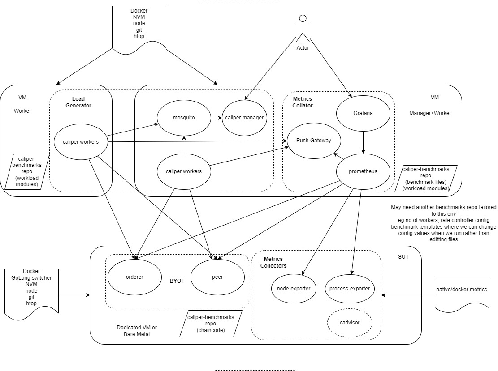

# Manual Performance Provision

This repo provides a turn key method for setting up a simple Hyperledger Fabric Benchmark environment
## Architecture



This solution currenty focuses on a fabric network deployed to a single node running either native or a lightweight container environment such as docker (not a heavy weight container orchestration system such as Kubernetes).

It's a Bring Your Own Fabric approach so doesn't mandate or manage how you bring your fabric up (eg test-network, test-network-nano-bash)
You will need to create your own channels and deploy your chaincode. This environment will work well with fabric-samples test-network or test-network-nano-bash

The components are split into 3 separate nodes (which could be baremetal, dedicated VM or other VM). this is to ensure that the benchmarking tools do not influence the results. For example caliper takes resource to drive a blockchain, the more work caliper has to do the less resource is available for fabric if they are running on the same machine. The other issue is that because caliper does use some resource it's also possible that the results caliper generates would be influenced by it's own resource limitations so that will result in less TPS and higher latencies. So this implementation allows the caliper workers to be split across multiple VMs to spread the load to ensure caliper has all the resource required to drive the Fabric network to the limits of the node it is running on. Also this is more real world where client applications would not be running on the same node(s) as the fabric network but more likely there will be multiple nodes running Fabric clients.

In the future if the Fabric Network was running in a K8s environment, does it make sense for the Caliper manager and Caliper workers to be deployed to K8s ? IMO no it doesn't. K8s primary goal is to keep a service (comprising of 1 or more processes) running. Both Caliper manager and Caliper workers terminate at the end of a benchmark and also you would want to see easily capture the continual output of the manager (watching the unfinished transaction count) as well as see the results. A project to perhaps create an environment inside of K8s that managed the launching of remote workers as well as ran caliper benchmarks on demand or scheduled and storing all the useful output in a PDF report for later retrieval would be good. How about calling it `Viper` ?

Although included in the architecture the capturing of caliper metrics in prometheus currently doesn't work due to issues with caliper

Finally this setup is currently configured to use the Peer Gateway Service so Fabric 2.4.3 or higher is required. This also reduces the workload on caliper but increases the workload on peer however this is the new business client API going forward with Fabric so seems reasonable to default to it. What would be interesting to know is if the decrease of resource used by caliper results in more or less increase of resource used by the fabric network.

## Install

Ensure you have Ubuntu installed on each node as this is the only linux distribution that has been tested

### SUT

This will install node and GoLang using the version switches NVM and GVM respectively to allow you to easily switch language versions. This is 2 fold.

1. To allow for test-network to be able to install typescript, go chaincode
2. To allow you to change versions of Go to compile a source installed fabric to explorer performance differences under different Go versions

It also installs docker to run the sut-services of prometheus exporters, it does not install docker-compose. If you use test-network then you can either install docker-compose or change the network.sh script file to use `docker compose` instead of `docker-compose`

- curl -ssL https://raw.githubusercontent.com/davidkel/provision-performance/main/BYOF/SUT/install.sh | bash -s
- exit and re-login
- Install/setup your fabric environment
- cd provision-performance/BYOF/SUT
- ./sut-services.sh start

### Manager

This will setup a Prometheus and Grafana server (with a pre-built dashboard called HLF Performances) as well as provide an environment to run the Caliper manager process (ie an mqtt broker and Caliper installed in the caliper-benchmarks directory)

- curl -ssL https://raw.githubusercontent.com/davidkel/provision-performance/main/BYOF/Manager/install.sh | bash -s
- exit and re-login
- cd provision-performance/BYOF/Manager
- ./configure-prometheus.sh -i <SUT_IP_ADDR> -p <PEER_OPERATIONS_PORTS> -o <ORDERER_OPERATIONS_PORTS> eg ./configure-prometheus.sh -i 192.168.55.2 -p 9444,9445 -o 9443
- ./manager-services.sh start

#### running a benchmark using run-benchmark.sh

To run a benchmark and dynamically set parameters like the number of workers and rate controller to use:
- run-benchmark.sh (This will prompt for information)


You can alternatively run a benchmark utilizing a specific benchmark file using ./launch-manager.sh (specify banchmark.yaml to utilize the file thst you previosly generated by suing run-benchamark.sh or specify any other spesific benchamrk file):

#### To run a benchmark using remote workers

- ./launch-manager.sh -b ~/caliper-benchmarks/benchmarks/api/fabric/empty-contract-1of.yaml

Note that if you use a relative path for the benchmark file they are relative to ~/caliper-benchmarks

#### To run a benchmark using local workers

- ./launch-manager.sh -b ~/caliper-benchmarks/benchmarks/api/fabric/empty-contract-1of.yaml -l

Grafana dashboard will be in port 3000 of this machine. Login admin/admin

### Worker/Manager as a worker

This will setup a Worker node (or the manager node) to run remote caliper workers.

Only run the install script if you aren't the manager and just a standalone worker

- curl -ssL https://raw.githubusercontent.com/davidkel/provision-performance/main/BYOF/Worker/install.sh | bash -s
- exit and re-login
- cd provision-performance/BYOF/Worker
- copy over a user cert and key file and the peer tls ca cert file
- ./configure-network-config.sh (This will prompt for information) or copy from another Worker node if already done previously

To launch a set of remote workers:

- ./launch-workers.sh -w <NUM_WORKERS> -i <MANAGER_IP_ADDR>

Once a benchmark is complete these workers will terminate. You will need to launch more workers to run another benchmark

## How to tune the Caliper environment

Caliper requires resources to drive load on an SUT, ideally you want to make sure that caliper itself doesn't become the bottleneck when performing a benchmark especially when running on VMs where 100% utilisation may mean something different between each run. Use `top` or `htop` to determine worker cpu use and overall system use. Ideally you want to keep both below the 100% utilisation mark to ensure consistent pressure across caliper runs

### How many workers should I use ?

If you aren't focusing on specific numbers of clients (and thus have a requirement for a specific number of workers) then you will want to utilise the caliper worker machine to it's best ability. For pure worker nodes I would start with 1.5*cores of the machine for number of workers. As a worker is node based it can only utilise a single core for execution of the javascript code, but I found that setting it to just the number of cores doesn't provide the most effective use of resource. 1.5*cores provides a starting point which you may want to tweak.

### How many overall workers (and thus extra VMs) should I use

This really depends on your use-case. You may decide to leave the load being generated by caliper as a constant and use the results such as latency and resource utilisation as a guide to determine performance improvement (TODO: concept of a performance score)

Alternatively you may be wanting to determine the maximum TPS possible. One approach is to try to find the maximum theoretical TPS of the fabric network. This should also require the most caliper resources to achieve and thus any real work done by caliper will always result in a smaller TPS and less work needed by caliper. If you have enough caliper resource for the theoretical TPS then you have enough for any other benchmark.

#### Determining the maximum theoretical TPS for a fabric

TODO: Also Will need a simple benchmark file to do this


#### Determining the max tps of a specific benchmark

TODO: fixed-tps and fixed-load

### rate controllers

### Things to look out for

1. newly deployed/upgraded chaincode may have an initial Latency. I've seen this from some cloud providers (not tried on a local fabric as yet) so worth running some empty transaction benchmark first to remove this Latency from the results
2. Tipping point, too high a load can result in less tps and higher latency than a lower load. This is the Tipping point of the fabric network
3. Watch the unfinished txns while caliper is observing if it continues to increase then you have overloaded the SUT and it will eventually result in errors

### Example of caliper being the bottleneck

```
+-----------------------------------+-------+------+-----------------+-----------------+-----------------+-----------------+------------------+
| Name                              | Succ  | Fail | Send Rate (TPS) | Max Latency (s) | Min Latency (s) | Avg Latency (s) | Throughput (TPS) |
|-----------------------------------|-------|------|-----------------|-----------------|-----------------|-----------------|------------------|
| empty-contract-evaluate-fixed-tps | 68761 | 0    | 572.9           | 0.20            | 0.00            | 0.02            | 572.9            |
+-----------------------------------+-------+------+-----------------+-----------------+-----------------+-----------------+------------------+
```

unfinished remained bounded with 10-13

but the benchmark was 7 workers with
```
      rateControl:
        type: fixed-rate
        opts:
          tps: 1500
```

10 workers resulted (bounded 15-18 on unfinished transactions)

```
+-----------------------------------+-------+------+-----------------+-----------------+-----------------+-----------------+------------------+
| Name                              | Succ  | Fail | Send Rate (TPS) | Max Latency (s) | Min Latency (s) | Avg Latency (s) | Throughput (TPS) |
|-----------------------------------|-------|------|-----------------|-----------------|-----------------|-----------------|------------------|
| empty-contract-evaluate-fixed-tps | 62332 | 0    | 519.4           | 0.30            | 0.00            | 0.03            | 519.3            |
+-----------------------------------+-------+------+-----------------+-----------------+-----------------+-----------------+------------------+
```

even less throughput

optimal workers for a 2 cpu Manager is probably 3 or 4 but above a certain number say 7 it is not so good

```
+-----------------------------------+-------+------+-----------------+-----------------+-----------------+-----------------+------------------+
| Name                              | Succ  | Fail | Send Rate (TPS) | Max Latency (s) | Min Latency (s) | Avg Latency (s) | Throughput (TPS) |
|-----------------------------------|-------|------|-----------------|-----------------|-----------------|-----------------|------------------|
| empty-contract-evaluate-fixed-tps | 67631 | 0    | 563.6           | 0.20            | 0.00            | 0.01            | 563.6            |
+-----------------------------------+-------+------+-----------------+-----------------+-----------------+-----------------+------------------+
```

Here is 3 but the latency is better with the send rate looking good

```
+-----------------------------------+-------+------+-----------------+-----------------+-----------------+-----------------+------------------+
| Name                              | Succ  | Fail | Send Rate (TPS) | Max Latency (s) | Min Latency (s) | Avg Latency (s) | Throughput (TPS) |
|-----------------------------------|-------|------|-----------------|-----------------|-----------------|-----------------|------------------|
| empty-contract-evaluate-fixed-tps | 67980 | 0    | 566.5           | 0.10            | 0.00            | 0.01            | 566.5            |
+-----------------------------------+-------+------+-----------------+-----------------+-----------------+-----------------+------------------+
```

Now moving to 2 VMs and remote workers running 3 workers each (as 2 core cpu on each)

```
+-----------------------------------+--------+------+-----------------+-----------------+-----------------+-----------------+------------------+
| Name                              | Succ   | Fail | Send Rate (TPS) | Max Latency (s) | Min Latency (s) | Avg Latency (s) | Throughput (TPS) |
|-----------------------------------|--------|------|-----------------|-----------------|-----------------|-----------------|------------------|
| empty-contract-evaluate-fixed-tps | 101968 | 0    | 849.7           | 0.17            | 0.00            | 0.01            | 849.6            |
+-----------------------------------+--------+------+-----------------+-----------------+-----------------+-----------------+------------------+
```

Note remote workers add overhead compared to local workers. Unfortunately you can't mix local/remote workers
looking at the SUT cpu, max was 75% so still caliper is the bottleneck

Note for evaluate txn it only picks on a single peer when using peer gateway

7 workers
```
+-----------------------------------+-------+------+-----------------+-----------------+-----------------+-----------------+------------------+
| Name                              | Succ  | Fail | Send Rate (TPS) | Max Latency (s) | Min Latency (s) | Avg Latency (s) | Throughput (TPS) |
|-----------------------------------|-------|------|-----------------|-----------------|-----------------|-----------------|------------------|
| empty-contract-evaluate-fixed-tps | 94666 | 0    | 788.9           | 0.25            | 0.00            | 0.02            | 788.8            |
+-----------------------------------+-------+------+-----------------+-----------------+-----------------+-----------------+------------------+
```
quite a drop and still doesn't manage to get to 1500 and the unfinished remained bounded so still caliper appears to be the bottleneck


now with a more powerful 4 cpu worker I get with 10 workers

```
+-----------------------------------+--------+------+-----------------+-----------------+-----------------+-----------------+------------------+
| Name                              | Succ   | Fail | Send Rate (TPS) | Max Latency (s) | Min Latency (s) | Avg Latency (s) | Throughput (TPS) |
|-----------------------------------|--------|------|-----------------|-----------------|-----------------|-----------------|------------------|
| empty-contract-evaluate-fixed-tps | 118298 | 0    | 985.7           | 0.62            | 0.01            | 0.05            | 985.6            |
+-----------------------------------+--------+------+-----------------+-----------------+-----------------+-----------------+------------------+
```

I think now the SUT is the bottleneck
