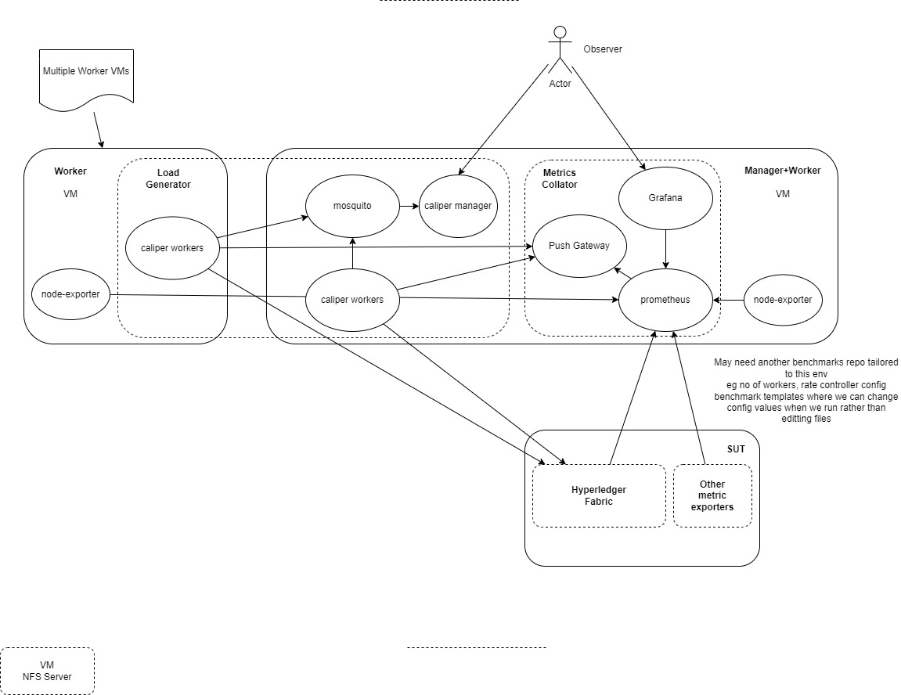

# Provision a Hyperledger Fabric Performance environment using caliper

Hyperledger Caliper (https://github.com/hyperledger/caliper) is a great tool for generating load on a hyperledger fabric network and recording it's findings around TPS (Transactions per Second) and latency. However the problem that people sometimes don't realise is that caliper itself becomes the bottleneck (or even a contender for resources if you try to run caliper and fabric on the same node) and the results are not the true capacity of the fabric network under test.

Hyperledger Fabric also integrates with prometheus (and thus grafana) to provide an excellent observability/query platform to live graph and query hyperledger fabric, VM and process metrics to help provide insight into the behaviour of your fabric network (and even caliper itself)

This repo looks at trying to automate the setup of performance environment within a VM environment. If you BYOF (Bring your own fabric) then this fabric can be run anyware (VMs, Docker, K8s etc) but the deployment of this platform is VM based. The reasons for this are

1. Developers can use this without the overhead of running a K8s cluster on their local machine (there are so many to choose from as well)
2. Caliper needs investigation into what it would take to run in K8s correctly without being a bottleneck and utilising allocated resources optimally
3. It's not meant to be a long term hyperledger fabric monitoring platform and you would never run a workload on your production instance

There are 2 separate parts to this repo, but both try to create the following high level architecture

## Automated

This deploys Hyperledger fabric from source (rather than published binaries) to VMs using ansible, it then deploys caliper and the observability components ready for caliper workloads to be run manually (automation to come later)
See [Readme](Automated/README.md)

## BYOF (Bring your own Fabric)

This provides simple scripts to setup a Manager and set of workers as well as configure a single node hyperledger fabric you provide and is more of a manual configuration currently (Automation and multi node SUT to come later)
See [Readme](BYOF/README.md)
