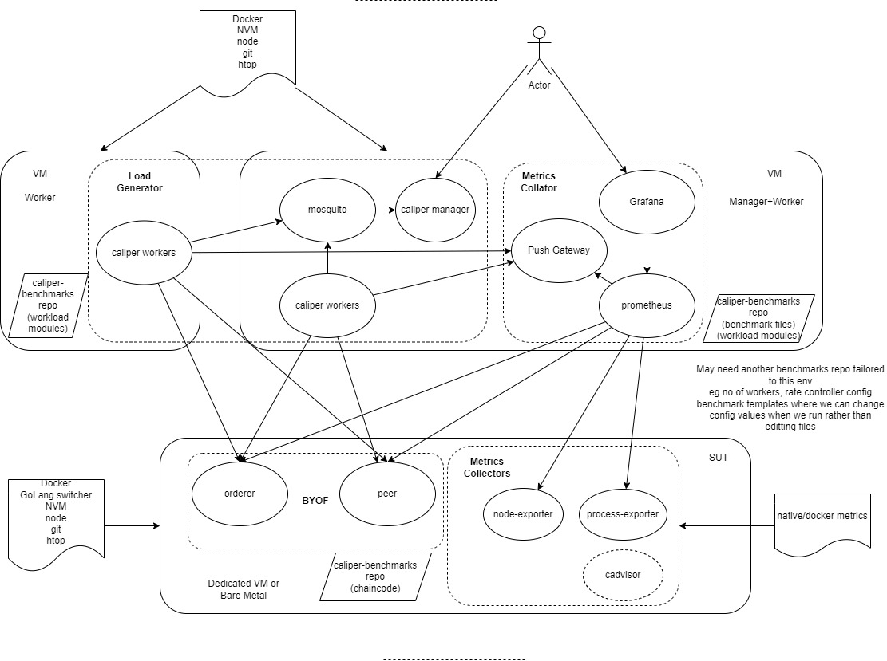

# Caliper Performance Provision

This repo provides a turn key method for setting up a simple Hyperledger Fabric Benchmark environment
## Architecture

This solution currenty focuses on a fabric network deployed to a single node running either native or a lightweight container environment such as docker (not a heavy weight container orchestration system such as Kubernetes).

It's currently a Bring Your Own Fabric approach so doesn't mandate or manage how you bring your fabric up (eg test-network, test-network-nano-bash)
You will need to create your own channels and deploy your chaincode. This environment will work well with fabric-samples test-network or test-network-nano-bash

The components are split into 3 separate nodes (which could be baremetal, dedicated VM or other VM). this is to ensure that the benchmarking tools do not influence the results. For example caliper takes resource to drive a blockchain, the more work caliper has to do the less resource is available for fabric if they are running on the same machine. The other issue is that because caliper does use some resource it's also possible that the results caliper generates would be influenced by it's own resource limitations so that will result in less TPS and higher latencies. So this implementation allows the caliper workers to be split across multiple VMs to spread the load to ensure caliper has all the resource required to drive the Fabric network to the limits of the node it is running on. Also this is more real world where client applications would not be running on the same node(s) as the fabric network but more likely there will be multiple nodes running Fabric clients.

In the future if the Fabric Network was running in a K8s environment, does it make sense for the Caliper manager and Caliper workers to be deployed to K8s ? IMO no it doesn't. K8s primary goal is to keep a service (comprising of 1 or more processes) running. Both Caliper manager and Caliper workers terminate at the end of a benchmark and also you would want to see easily capture the continual output of the manager (watching the unfinished transaction count) as well as see the results. A project to perhaps create an environment inside of K8s that managed the launching of remote workers as well as ran caliper benchmarks on demand or scheduled and storing all the useful output in a PDF report for later retrieval would be good. How about calling it `Viper` ?

Although included in the architecture the capturing of caliper metrics in prometheus currently doesn't work due to issues with caliper

Finally this setup is currently configured to use the Peer Gateway Service so Fabric 2.4.3 or higher is required. This also reduces the workload on caliper but increases the workload on peer however this is the new business client API going forward with Fabric so seems reasonable to default to it. What would be interesting to know is if the decrease of resource used by caliper results in more or less increase of resource used by the fabric network.

## Install

Ensure you have Ubuntu installed on each node as this is the only linux distribution that has been tested

### SUT

This will install node and GoLang using the version switches NVM and GVM respectively to allow you to easily switch language versions. This is 2 fold.

1. To allow for test-network to be able to install typescript, go chaincode
2. To allow you to change versions of Go to compile a source installed fabric to explorer performance differences under different Go versions

It also installs docker to run the sut-services of prometheus exporters, it does not install docker-compose. If you use test-network then you can either install docker-compose or change the network.sh script file to use `docker compose` instead of `docker-compose`

- curl -ssL https://raw.githubusercontent.com/davidkel/provision-performance/main/SUT/install.sh | bash -s
- exit and re-login
- Install/setup your fabric environment
- cd provision-performance/SUT
- ./sut-services.sh start

### Manager

This will setup a Prometheus and Grafana server (with a pre-built dashboard called HLF Performances) as well as provide an environment to run the Caliper manager process (ie an mqtt broker and Caliper installed in the caliper-benchmarks directory)

- curl -ssL https://raw.githubusercontent.com/davidkel/provision-performance/main/Manager/install.sh | bash -s
- exit and re-login
- cd provision-performance/Manager
- ./configure-prometheus.sh -i <SUT_IP_ADDR> -p <PEER_OPERATIONS_PORTS> -o <ORDERER_OPERATIONS_PORTS> eg ./configure-prometheus.sh -i 192.168.55.2 -p 9444,9445 -o 9443
- ./manager-services.sh start

To run a benchmark and dinamically set parameters like the number of workers and rate controller to use:
- run-benchmark.sh (This will prompt for information)

You can alternatively run a benchmark utilizing a specific benchmark file using ./launch-manager.sh (specify banchmark.yaml to utilize the file thst you previosly generated by suing run-benchamark.sh or specify any other spesific benchamrk file):

To run a benchmark using remote workers:

- ./launch-manager.sh benchmarks/api/fabric/empty-contract-1of.yaml

Note that the relative benchmark files are relative to ~/caliper-benchmarks

To run a benchmark using local workers:

- ./launch-manager.sh ~/caliper-benchmarks/benchmarks/api/fabric/empty-contract-1of.yaml -l

Grafana dashboard will be in port 3000 of this machine. Login admin/admin

### Worker/Manager as a worker

This will setup a Worker node (or the manager node) to run remote caliper workers.

Only run the install script if you aren't the manager and just a standalone worker

- curl -ssL https://raw.githubusercontent.com/davidkel/provision-performance/main/Worker/install.sh | bash -s
- exit and re-login
- cd provision-performance/Worker
- copy over a user cert and key file and the peer tls ca cert file
- ./configure-network-config.sh (This will prompt for information) or copy from another Worker node if already done previously

To launch a set of remote workers:

- ./launch-workers.sh -w <NUM_WORKERS> -i <MANAGER_IP_ADDR>

Once a benchmark is complete these workers will terminate. You will need to launch more workers to run another benchmark

## How to tune the Caliper environment

TODO Need to provide information on:
1. how to determine theoretical maximum tps (create a benchmark to help with this)
2. how to find the max tps when using fixed-tps (create a simpler create-asset benchmark)
3. after you document how to achieve the max tps than advice and do recommendation to how to tune a calliper environment and which rate controllers to use respectively
- how many Worker VMs
- how many workers per node (use htop)
- how many workers per benchmark
- rate controllers and their values
- how to determine theoretical maximum tps (create a benchmark to help with this)
- how to find the max tps when using fixed-tps (create a simpler create-asset benchmark)

## TODO

The plan is to make this environment as turnkey and easy to use as possible

1. Address TODOs in scripts
2. launch-manager.sh should allow for file completion to make it quick and easy to get to a benchmark file //need to implement rate contoller and its setting file compilation

### Further ideas

1. option to provide a managed fabric
2. dynamic caliper benchmarks (eg autochange workers, rate-controllers)
3. benchmark files to extract prometheus data
4. use pushgateway to capture worker stats and display on separate dashboard (Need fixes to caliper)
5. prometheus to scrape caliper manager (requires a new caliper feature)
6. add manager and worker vms to their own dashboard
7. support remote file systems to test disk i/o latency
8. Should we provide our own set of Benchmark files (ie current set not appropriate ?) until we can get the set into caliper-benchmarks ?
9. could this be extended to a single node, then multi-node K8s Environent ?

### Managed Fabric

- Deploy a native fabric
  - run 1 orderer, 2 orgs, 1 peer per org
  - install fixed-asset-base chaincode
- less input for generating sut-network, prometheus file so setup is easier
- automate running of tests and picking up changes in code base
